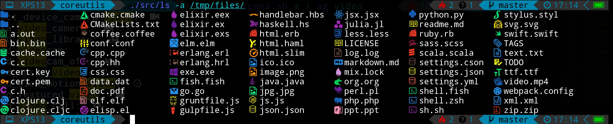

## Overview

This is a fork of [coreutils](https://github.com/coreutils/coreutils) with a modified ls that print icons  

## Dependencies

- gcc  
- [icons-in-terminal](https://github.com/sebastiencs/icons-in-terminal)  

## Installation

You need to install [icons-in-terminal](https://github.com/sebastiencs/icons-in-terminal) first (No worries, it won't replace your font).  
Once installed, you can run:  
```bash
$ ./bootstrap
$ ./configure --prefix=/opt/coreutils
$ make
$ make install
$ /opt/coreutils/bin/ls
```
